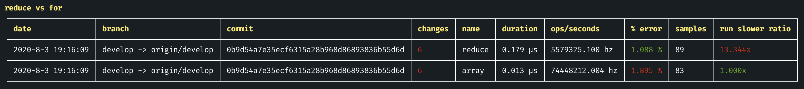

# jest-performance

A [Benchmark js](https://benchmarkjs.com/) integration for [Jest js](https://jestjs.io/)  

## Install

```
npm i -D jest-performance
```
or
```
yarn add -D jest-performance
```

## example 
```js
const array = [];
for (let i = 0; i < 10; i++) {
  array.push(array.length);
}

it('reduce v3 vs for v2', async () => {
  await expect().benchmark({
    'reduce v3': () => {
      const sum = array.reduce((acc, x) => acc + x, 0);
    },
    'for v4': () => {
      let sum = 0;
      for (let i = 0, arrayLength = array.length; i < arrayLength; i++) {
        sum += array[i];
      }
    },
  });
});
```

will print:


## Setup

#### Jest >v24
Add `jest-performance` to your Jest `setupFilesAfterEnv` configuration
```
"jest": {
  "setupFilesAfterEnv": ["jest-performance"]
}
```

#### Jest <v23
```
"jest": {
  "setupTestFrameworkScriptFile": "jest-performance"
}
```

If you are already using another test framework, then you should create a test setup file and require each of the frameworks you are using.

For example:

```js
// ./testSetup.js
require('jest-performance');
require('any other test framework libraries you are using');
```

Then in your Jest config:

```
"jest": {
  "setupTestFrameworkScriptFile": "./testSetup.js"
}
```

Also, since benchmarks tests are going to be slow, I suggest having a dedicated Jest setup for it. Something like:

```js
// jest.perf.config.js
const baseConfig = require('./jest.config.js')
module.exports = {
  ...baseConfig,
  'cacheDirectory': './node_modules/.jestCachePerf',
  'testMatch': ['**/?(*.)(spec|test?(s)).perf.js?(x)'],
  "setupFilesAfterEnv": ["jest-performance"],
}
```

And a dedicated script:
```
"scripts": {
  // ...
  "test:perf": "jest --config ./jest.perf.config.js"
}
```
